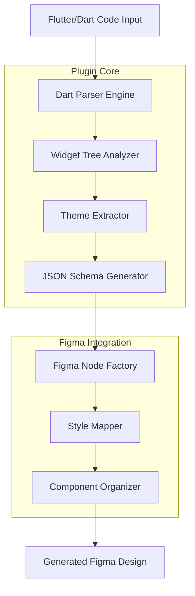

# Design Document

## Overview

The Flutter → Figma Plugin is designed as a Figma plugin that accepts Flutter/Dart source code and generates corresponding Figma designs. The plugin consists of two main components: a Dart code parser that analyzes Flutter widget trees and extracts styling information, and a Figma node generator that creates native Figma elements with proper Auto Layout, Variables, and Components.

The architecture follows a pipeline approach: Code Input → Parsing → Schema Generation → Figma Node Creation → Style Application → Component Organization.

## Architecture

### High-Level Architecture



### Component Architecture

The plugin is structured into several key modules:

1. **Parser Module**: Handles Dart code analysis and widget tree extraction
2. **Schema Module**: Converts parsed data into a neutral JSON representation
3. **Figma Module**: Creates and manages Figma nodes, variables, and components
4. **UI Module**: Provides the plugin interface for file upload and configuration
5. **Error Handling Module**: Manages parsing errors and user feedback

## Components and Interfaces

### 1. Dart Parser Engine

**Purpose**: Analyzes Flutter/Dart source code to extract widget information

**Key Classes**:
- `DartParser`: Main parser class that tokenizes and analyzes Dart code
- `WidgetExtractor`: Identifies Flutter widgets and their properties
- `ThemeAnalyzer`: Extracts ThemeData and styling information

**Interface**:
```typescript
interface DartParser {
  parseFile(content: string): ParseResult;
  extractWidgets(ast: ASTNode[]): Widget[];
  validateSyntax(content: string): ValidationResult;
}

interface ParseResult {
  widgets: Widget[];
  themes: ThemeData[];
  errors: ParseError[];
  warnings: string[];
}
```

### 2. Widget Tree Analyzer

**Purpose**: Builds hierarchical widget structures and identifies relationships

**Key Classes**:
- `WidgetTreeBuilder`: Constructs widget hierarchy
- `LayoutAnalyzer`: Determines layout properties and constraints
- `ComponentDetector`: Identifies reusable widgets for component creation

**Interface**:
```typescript
interface WidgetTree {
  root: Widget;
  components: ReusableWidget[];
  layouts: LayoutInfo[];
}

interface Widget {
  type: string;
  properties: Record<string, any>;
  children: Widget[];
  styling: StyleInfo;
  position?: PositionInfo;
}
```

### 3. Figma Node Factory

**Purpose**: Creates Figma nodes based on widget specifications

**Key Classes**:
- `NodeFactory`: Factory for creating different Figma node types
- `LayoutBuilder`: Applies Auto Layout properties
- `ComponentBuilder`: Creates Figma Components and Variants

**Interface**:
```typescript
interface NodeFactory {
  createFrame(widget: Widget): FrameNode;
  createText(widget: Widget): TextNode;
  createComponent(widget: ReusableWidget): ComponentNode;
  applyAutoLayout(node: FrameNode, layout: LayoutInfo): void;
}
```

### 4. Style Mapper

**Purpose**: Converts Flutter styling to Figma Variables and styles

**Key Classes**:
- `VariableManager`: Creates and manages Figma Variables
- `ColorMapper`: Maps Flutter colors to Figma color variables
- `TypographyMapper`: Converts Flutter text styles to Figma typography
- `SpacingMapper`: Handles padding, margin, and spacing values

**Interface**:
```typescript
interface StyleMapper {
  createVariables(themes: ThemeData[]): Variable[];
  applyStyles(node: SceneNode, styling: StyleInfo): void;
  mapColors(colorScheme: ColorScheme): ColorVariable[];
  mapTypography(textTheme: TextTheme): TypographyVariable[];
}
```

## Data Models

### Core Data Structures

```typescript
// Widget representation
interface Widget {
  id: string;
  type: WidgetType;
  properties: WidgetProperties;
  children: Widget[];
  styling: StyleInfo;
  layout?: LayoutInfo;
  position?: PositionInfo;
}

// Styling information
interface StyleInfo {
  colors: ColorInfo[];
  typography?: TypographyInfo;
  spacing?: SpacingInfo;
  borders?: BorderInfo;
  shadows?: ShadowInfo;
}

// Theme data structure
interface ThemeData {
  colorScheme: ColorScheme;
  textTheme: TextTheme;
  spacing: SpacingScale;
  borderRadius: BorderRadiusScale;
}

// Layout information
interface LayoutInfo {
  type: 'row' | 'column' | 'stack' | 'wrap' | 'flex';
  direction?: 'horizontal' | 'vertical';
  alignment?: AlignmentInfo;
  spacing?: number;
  padding?: EdgeInsets;
}

// Figma-specific structures
interface FigmaNodeSpec {
  type: 'FRAME' | 'TEXT' | 'RECTANGLE' | 'COMPONENT';
  properties: Record<string, any>;
  autoLayout?: AutoLayoutSpec;
  variables?: VariableBinding[];
}
```

### Widget Type Mapping

```typescript
enum WidgetType {
  CONTAINER = 'Container',
  ROW = 'Row',
  COLUMN = 'Column',
  STACK = 'Stack',
  TEXT = 'Text',
  IMAGE = 'Image',
  BUTTON = 'ElevatedButton',
  CARD = 'Card',
  SCAFFOLD = 'Scaffold',
  APP_BAR = 'AppBar',
  CUSTOM = 'Custom'
}

const WIDGET_TO_FIGMA_MAPPING: Record<WidgetType, string> = {
  [WidgetType.CONTAINER]: 'FRAME',
  [WidgetType.ROW]: 'FRAME', // with horizontal auto-layout
  [WidgetType.COLUMN]: 'FRAME', // with vertical auto-layout
  [WidgetType.STACK]: 'FRAME', // with absolute positioning
  [WidgetType.TEXT]: 'TEXT',
  [WidgetType.IMAGE]: 'RECTANGLE', // with image fill
  [WidgetType.BUTTON]: 'COMPONENT',
  [WidgetType.CARD]: 'COMPONENT',
  [WidgetType.SCAFFOLD]: 'FRAME',
  [WidgetType.APP_BAR]: 'COMPONENT'
};
```

## Error Handling

### Error Categories

1. **Syntax Errors**: Invalid Dart code that cannot be parsed
2. **Widget Errors**: Unrecognized or unsupported Flutter widgets
3. **Theme Errors**: Invalid or missing theme data
4. **Conversion Errors**: Issues during Figma node creation
5. **Variable Errors**: Problems with Figma Variable creation or binding

### Error Handling Strategy

```typescript
interface ErrorHandler {
  handleParseError(error: ParseError): void;
  handleWidgetError(widget: Widget, error: WidgetError): void;
  handleConversionError(error: ConversionError): void;
  showUserFeedback(message: string, type: 'error' | 'warning' | 'info'): void;
}

class GracefulErrorHandler implements ErrorHandler {
  // Provides fallback options for unsupported widgets
  // Logs detailed error information for debugging
  // Shows user-friendly error messages
  // Continues processing other widgets when possible
}
```

### Fallback Mechanisms

- **Unsupported Widgets**: Create placeholder frames with descriptive names
- **Missing Themes**: Use default Material Design theme values
- **Complex Layouts**: Simplify to basic frame structures with notes
- **Custom Painted Widgets**: Create placeholder with import suggestions

## Testing Strategy

### Unit Testing

1. **Parser Tests**: Verify correct parsing of various Flutter widget patterns
2. **Widget Extraction Tests**: Ensure accurate widget tree construction
3. **Style Mapping Tests**: Validate theme-to-variable conversion
4. **Node Creation Tests**: Test Figma node generation for each widget type

### Integration Testing

1. **End-to-End Tests**: Complete workflow from Dart code to Figma design
2. **Theme Integration Tests**: Multi-mode theme handling
3. **Component Tests**: Reusable widget to Figma Component conversion
4. **Layout Tests**: Complex layout scenarios (nested, responsive)

### Test Data

```typescript
// Sample test cases
const TEST_WIDGETS = {
  simpleContainer: `
    Container(
      width: 100,
      height: 100,
      color: Colors.blue,
      child: Text('Hello')
    )
  `,
  complexLayout: `
    Column(
      children: [
        Row(
          children: [
            Expanded(child: Text('Left')),
            Text('Right')
          ]
        ),
        Container(height: 20),
        ElevatedButton(
          onPressed: () {},
          child: Text('Button')
        )
      ]
    )
  `,
  themedWidget: `
    Container(
      color: Theme.of(context).primaryColor,
      child: Text(
        'Themed Text',
        style: Theme.of(context).textTheme.headline1
      )
    )
  `
};
```

### Performance Testing

- **Large Widget Trees**: Test with complex, deeply nested widget hierarchies
- **Multiple Themes**: Verify performance with multiple theme modes
- **Memory Usage**: Monitor memory consumption during parsing and generation
- **Figma API Limits**: Test within Figma's node creation limits

### User Acceptance Testing

- **Designer Workflow**: Test with actual designers using generated components
- **Developer Feedback**: Validate accuracy of generated designs against code
- **Error Scenarios**: Test user experience with various error conditions
- **File Format Support**: Test with different Dart file structures and patterns