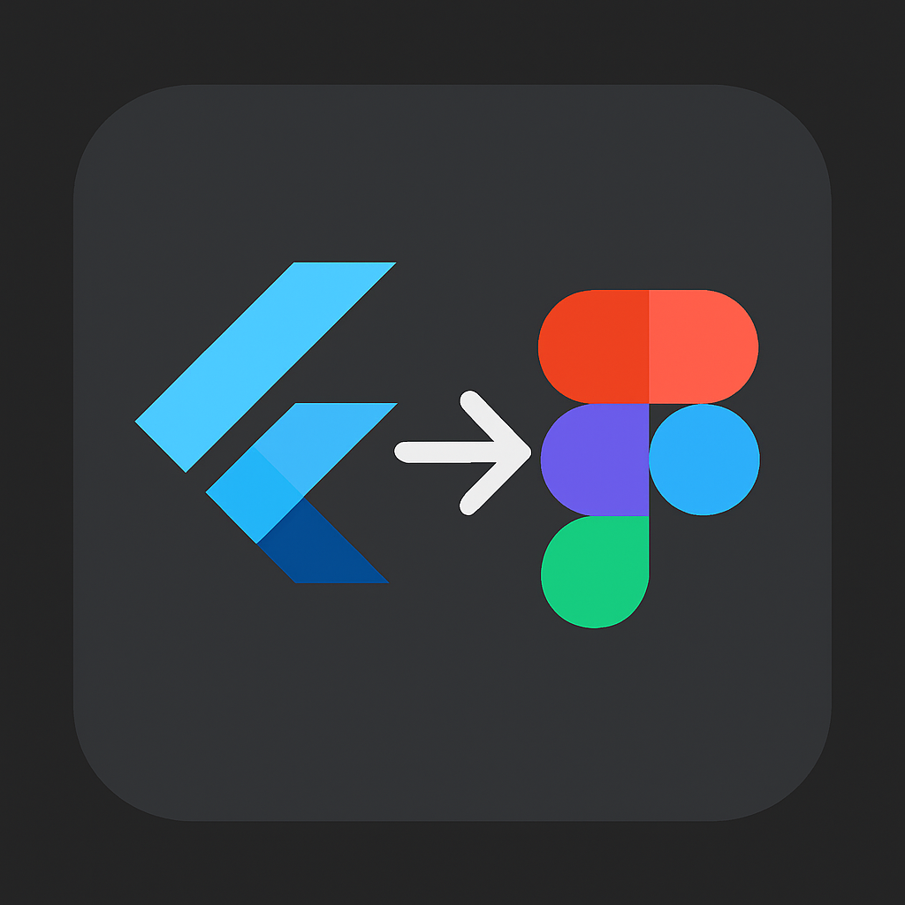

# Flutter → Figma Plugin

## Description

The **Flutter → Figma Plugin** is an experimental bridge between code and design. Its purpose is to automatically generate Figma designs from existing Flutter/Dart codebases, allowing developers and designers to work from a shared source of truth. By parsing Flutter widget trees, extracting styles from ThemeData, and translating layouts into Figma’s native Auto Layout and variable systems, the plugin recreates full screens or individual widgets directly on the Figma canvas.

The result is a set of editable, token-driven Figma frames that accurately reflect the app’s implementation, making it easier to:

-	Keep design and code in sync
-	Share production-accurate screens with design teams
-	Document component libraries and design systems
-	Visualize complex widget hierarchies in a designer-friendly format

## How It Works

1.	Code Parsing – A small analyzer processes Dart source files and emits a neutral JSON schema describing widgets, layout properties, and styles.
2.	Plugin Execution – The Figma plugin reads the schema and constructs corresponding Figma nodes: frames, auto-layout containers, text nodes, images, and components.
3.	Style Application – The plugin maps Flutter ThemeData into Figma Variables for color, spacing, and typography. Multiple modes (e.g., light/dark, mobile/desktop) are supported.
4.	Component & Screen Creation – Reusable widgets become Figma Components with Variants; full screens are built as Frames containing instances of these components.
5.	Sync & Updates – The workflow can be tied to CI/CD or webhooks, so Figma stays updated as the Flutter code evolves.

## Key Features

-	🔄 Code-to-Design Sync – Generate designs directly from Flutter source code.
-	🖼️ Widget & Screen Support – Works at both the component and full-screen level.
-	🎨 Tokenized Styling – Maps Flutter themes to Figma Variables for responsive, scalable design.
-	📱 Multi-Form Factor Output – Auto-layout rules and variable modes generate designs for multiple screen sizes and devices.
-	🧩 Component Libraries – Identifies reusable Flutter widgets and mirrors them as Figma Components with Variants.
-	⚡ Complex Widget Handling – Supports stacks, positioned layouts, and falls back gracefully to vector or raster imports for custom-painted widgets.

## Vision

Designers and developers often struggle to keep interfaces consistent across code and design tools. The Flutter → Figma Plugin aims to remove that barrier by making code itself the canonical source of design truth. With this system, design teams gain editable, systemized files without needing to recreate screens by hand, while development teams benefit from faster iteration, clearer documentation, and alignment between design specs and real implementation.